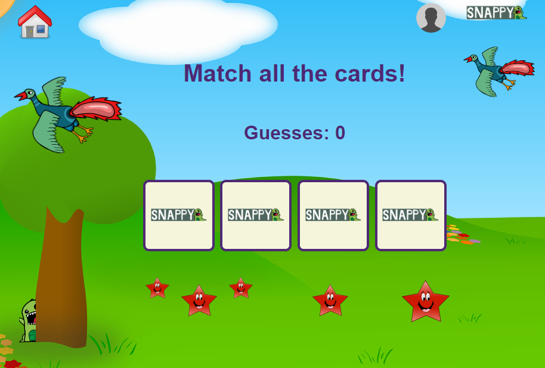

# Snappy - Children's Games

## Description

Snappy is a digital game based on the classic card game Snap, aimed at children between the ages of 2 and 6. It offers two levels of difficulty, allowing young players to progress as they learn and grow. Snappy has several educational benefits for toddlers, making it an ideal way for them to learn while having fun.

Snappy improves memory and attention span as players must pay close attention to the cards being played and remember which cards have been placed down. It helps to develop their memory and focus as they work to play the game successfully.

In addition, Snappy builds counting and number recognition skills. The game involves matching cards with the same number or picture, which reinforces counting skills and helps children learn to recognize numbers and shapes.

Finally, Snappy encourages strategic thinking, which helps to develop problem-solving and strategic thinking skills in toddlers. Overall, Snappy is a fun and engaging way for toddlers to develop a range of important skills that can benefit their education and social development. It's a great addition to any parent or teacher's toolkit for promoting learning through play.

Deployed at: [Netlify Link](https://phenomenal-alfajores-f3e735.netlify.app/)

Presentation link: [Google Slides Link](https://docs.google.com/presentation/d/1rf7bv4am1FfZIyf8kbuAvhLIhxF8ta1auOHP4mEXF3E/edit#slide=id.g22877d5623d_0_8)

## Contents

- [Video Demo](#video-demo)
- [Credits](#credits)
- [License](#license)
- [Contributing](#contributing)
- [Tests](#tests)
- [Questions](#questions)

## Video Demo

## Credits

### Collaborators:

- David Salvat [GitHub Profile](https://github.com/dalvat/)
- Sean Howe [GitHub Profile](https://github.com/SeanMH8911/)
- Zuzana Knightova [GitHub Profile](https://github.com/ZuzanaElt)

#### Attributions:

- ReactJS [Link to website](https://react.dev/)
- Sass [Link to website](https://sass-lang.com/)
- supabase [Link to website](https://supabase.com/)

## License

This project uses the following license:

The MIT License

## Contributing

Feel free to clone this repository to your local computer and explore the code. If you think some improvements can be made you can get in touch with us using the details in the [credits](#credits) section.

## Tests

I am not aware of any bugs in the current version of the app, but if you encounter anything, please get in touch with us using the details in the [credits](#credits) section.

## Questions

If you have any questions, feel free to get in touch with us using the details in the [credits](#credits) section.